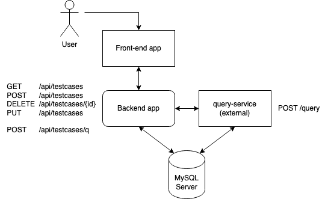

# [WIP] Test Case Management System - Spring Boot CRUD Application

This project is a simple Test Case Management System built using Spring Boot, Java 17, Maven, OpenFeign, OpenAPI, and a variety of testing technologies. The primary goal of this project is to showcase the basics of backend development with Spring Boot and demonstrate the capabilities of the Spring Boot test framework, including test slices. The project also integrates a frontend application developed using JavaScript and Vue.js, as well as a query-service implemented in Python using Flask and LangChain.

## Features

- **CRUD Operations**: The Spring Boot CRUD application provides endpoints for creating, reading, updating, and deleting test cases.
- **Integration with query-service**: The Spring Boot application can communicate with the query-service internally to perform specific operations.
- **Frontend Interaction**: Users can interact with the application through a user interface (UI) developed using JavaScript and Vue.js.

## Tech Stack

### Backend

- Java 17
- Maven
- Spring Boot
- MySQL
- OpenFeign for internal communication
- OpenAPI for API documentation

### Testing

- JUnit 5
- Testcontainers for containerized integration tests
- WireMock for mocking external services

### Frontend

- JavaScript
- Vue.js

### query-service

- Python
- Flask
- LangChain

## Project Structure

The project is structured as follows:

- `backend` module: Contains the Spring Boot CRUD application, including API endpoints, data models, and business logic.
- `frontend` module: Contains the frontend application built using JavaScript and Vue.js for user interaction.
- `query-service` module: Implements the query-service using Python, Flask, and LangChain for specific operations.
<!-- - `docker` folder: Contains Docker configuration files for containerization. -->

## Running the Application

1. Clone the repository
1. Start MySQL docker container: `docker run --name some-mysql -p 3306:3306 -e MYSQL_ROOT_PASSWORD=test-password -d mysql`
1. Navigate to the `backend` directory
1. Build and run the Spring Boot application: `mvn spring-boot:run`
1. Open a new terminal window and navigate to the `frontend` directory
1. Start the frontend application: 
    - `npm install`
    - `npm run dev`
1. Open a new terminal window and navigate to the `query-service` directory
1. Start query-service:
    - `export OPENAI_API_KEY="{your_openai_api_key}"`
    - `pip install -r requirements.txt`
    - `python app.py`
1. Open browser and navigate to `http://localhost:5173/`
1. To test the Spring Boot application, navigate to the `backend` directory and run: `mvn test`
